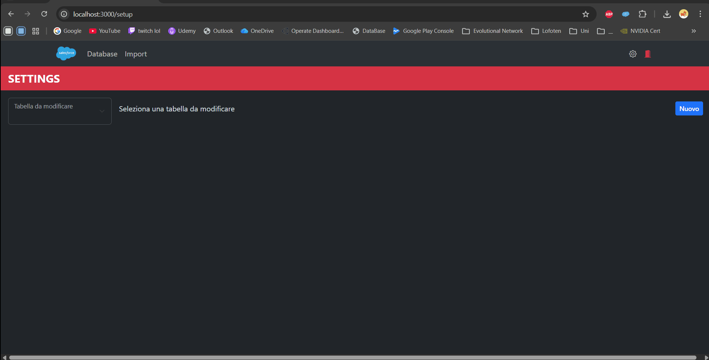

# FullStack CRM Web Application


## Index
- [Project Overview](#project-overview)
- [Key Features](#key-features)
- [Tech Stack](#tech-stack)
- [Visual Showcase](#visual-showcase)
- [Engineering Challenges & Solutions](#engineering-challenges--solutions)
- [Roadmap](#roadmap)
- [Installation & Setup](#installation--setup)
- [Execution](#execution)

## Project Overview
This project is a full-stack architectural experiment designed to explore the core mechanics of a CRM platform like Salesforce. 
I built this application to replicate dynamic object creation, metadata-driven UI rendering, and efficient data handling using a modern stack: 
  - **React** for the frontend
  - **Python (FastAPI)** for the middleware
  - **MySQL** for the database


## Key Features
* **Dynamic UI Architecture:** The interface renders inputs, tables, and layouts dynamically based on metadata configurations retrieved from the backend (inspired by Salesforce Layouts)
* **Custom Object Management:** Users can define new tables and fields via the UI. The Python middleware dynamically translates these definitions into SQL schema changes
* **Authentication & Setup:** Secure login flow and environment configuration
* **Massive Data Handling:** Optimized logic for bulk operations and massive record inserts using **Pandas** for efficient data processing.
* **Middleware Logic:** A FastAPI layer acting as the orchestrator between the relational SQL structure and the flexible frontend requirements.


## Tech Stack
* **Frontend:** React.js (Axios, React-Bootstrap, React Router, React Hook Form)
* **Backend:** Python (FastAPI, Pandas)
* **Database:** MySQL
* **Environment:** Local Development Environment


## Visual Showcase
### Custom Object Creation + Dynamic UI Rendering
> *Show the 'Admin' side: "Creating a new custom object and seeing it reflected in the database schema."*


### Massive Data Insert
> *Show the success message after a bulk insert: "Handling 5k+ records using Pandas integration."*


## Engineering Challenges & Solutions
### 1. Dynamic Schema Mapping
**Problem:** How to allow users to create "fields" and "objects" on the fly without breaking the database schema?
**Solution:** Built a metadata-driven engine where table and field definitions are stored as data. The Python middleware interprets these definitions to construct raw SQL queries dynamically.


## Roadmap: 
* **Web Finalization:** Complete the remaining features in the backlog
* **Move to Mobile:** Develop a **React Native** application to interact with the CRM's core features. Since the architecture is already API-first, the goal is to reuse the FastAPI middleware to power a cross-platform mobile experience.


## Installation & Setup
To run this project locally:

1.  **Download the "crm" folder**
2.  **Database** Import the `schema.sql` file located in the `sqlDump` folder into your MySQL instance.
3.  **Configure the configuration files**
    ```bash
    cd crm
    Rename config.example.ini into config.ini
    Edit the config.ini file with your local database credentials
    ```

    
## Execution
1. Run the **.exe** inside the "crm" folder
2. The application will automatically open a new Chrome tab
3. A dedicated tray icon allows you to manage the server status or re-open the browser interface


---
*Author: Pascarella Valerio*
*This project is a technical showcase for transitioning from Salesforce development to full-stack & mobile engineering.*
